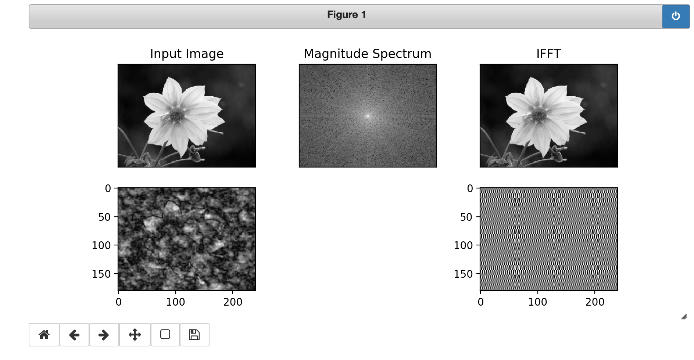
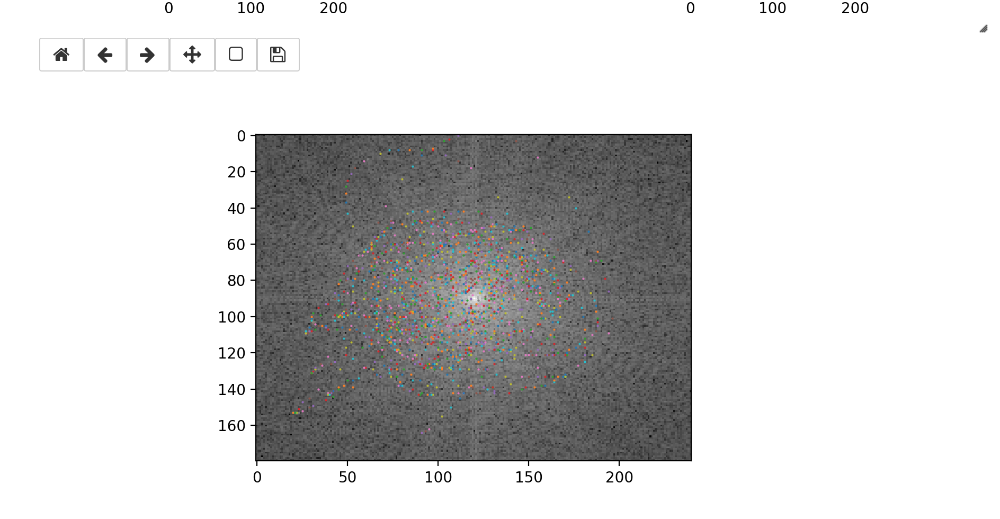

# ディジタル信号処理と画像処理
## フーリエ変換

B173394 

- OpenCVを用いてフーリエ変換・逆フーリエ変換をリアルタイムに行う. マウスで周波数を指定する. 

以下にソースコードを示す. まずAnacondaをインストールし, JupyterにてOpenCVをインストールした. 

``` Python
import numpy as np
import cv2
from matplotlib import pyplot as plt


img = cv2.imread('flower.jpg',0)
img = cv2.resize(im,(240,180))

clicklog = np.zeros(im.shape)

# フーリエ変換
dft = cv2.dft(np.float32(img),flags = cv2.DFT_COMPLEX_OUTPUT)
dft_shift = np.fft.fftshift(dft)
magnitude_spectrum = 20*np.log(cv2.magnitude(dft_shift[:,:,0],dft_shift[:,:,1]))

# 逆フーリエ変換
dft_ishift = np.fft.ifftshift(dft_shift)
img_back = cv2.idft(dft_ishift)
img_back = cv2.magnitude(img_back[:,:,0],img_back[:,:,1])


def addClick(x,y,click):
A = click
A[y,x] = 1
return A

def mkWave(x, y):
h = np.zeros(im.shape)
h[y, x] = 1
wave = cv2.idft(h)
return wave

def reset(x, y, A):
y = np.zeros(dft_shift.shape)
y[:,:,0] = A 
y[:,:,1] = A 
copy = dft_shift*y
copy = np.fft.ifftshift(copy)
copy = cv2.idft(copy)
re = cv2.magnitude(copy[:,:,0],copy[:,:,1])
return re

def click(event):
global clicklog, X, Y

if event.button == 1:
X = int(round(event.xdata))
Y = int(round(event.ydata))

ax7.plot(X, Y, marker='.', markersize='1')

clicklog = addClick(X, Y, clicklog)

def key(event):
if event.key == 'q':
sys.exit()

def release(event):
global clicklog, X, Y
wave = mkWave(X, Y)
ax6.imshow(wave, cmap='gray')

reim = reset(X, Y, clicklog)
reim = np.float32(reim)
ax4.imshow(reim, cmap='gray')

plt.draw()

fig = plt.figure(figsize=(9,4))

ax1 = fig.add_subplot(2,3,1)
ax1.imshow(im, cmap='gray')
ax1.set_title('Input Image')
ax1.set_xticks([]), ax1.set_yticks([])

ax2 = fig.add_subplot(2,3,2)
ax2.imshow(magnitude_spectrum, cmap='gray')
ax2.set_title('Magnitude Spectrum')
ax2.set_xticks([]), ax2.set_yticks([])

ax3 = fig.add_subplot(2,3,3)
ax3.imshow(img_back, cmap='gray')
ax3.set_title('IFFT')
ax3.set_xticks([]), ax3.set_yticks([])

ax4 = fig.add_subplot(2,3,4)

ax6 = fig.add_subplot(2,3,6)

wind2=plt.figure(figsize=(8,4))

ax7 = wind2.add_subplot(1,1,1)
ax7.imshow(magnitude_spectrum, cmap='gray')

plt.subplots_adjust(left=None, bottom=None, right=None, top=None, wspace=0.5, hspace=0)

wind2.canvas.mpl_connect('button_press_event', click)
wind2.canvas.mpl_connect('motion_notify_event', click)
wind2.canvas.mpl_connect('button_release_event', release)
wind2.canvas.mpl_connect('key_press_event', key)

```
- コードの説明
    - フーリエ変換と逆フーリエ変換に関してはサイトを参照した. 
```Python
# フーリエ変換
dft = cv2.dft(np.float32(img),flags = cv2.DFT_COMPLEX_OUTPUT)
dft_shift = np.fft.fftshift(dft)
magnitude_spectrum = 20*np.log(cv2.magnitude(dft_shift[:,:,0],dft_shift[:,:,1]))

# 逆フーリエ変換
dft_ishift = np.fft.ifftshift(dft_shift)
img_back = cv2.idft(dft_ishift)
img_back = cv2.magnitude(img_back[:,:,0],img_back[:,:,1])
```
- 
    - 周波数の指定を配列を使って行う. クリックした座標を1, そうでない座標を0で記録し表示するようにしている. そのための関数が`addClick(x,y,click)`である. 
    - sin波を切り抜く関数が`mkWave(x, y)`である. 
    - sin波を合成するのが`reset(x, y, A)`である. yの処理は元に戻ることを確認する処理である. フーリエ変換をした値を使用している. 
    - クリックをした時の処理が`click(event)`である. グローバル変数を用いる. クリックをしながらドラッグをしている時に得た座標情報をX, Yに代入している. えたタデータからドラッグしているグラフにドラッグの後を表記させる. 最後にい通化した地点を通過済みにするためにaddClick関数を行なってcliklogに代入している. これにより前の値が引き継がれるようになっている. 
    - 関数`key(event)`によってキーボードより"q"が入力されたら動作を終了するようにしている. 
    関数`release(event)`でドラッグが終了した後(指を離したあと)ドラッグに対するフーリエ変換の計算をしてその画像と合成した画像を表示させている. まず, ドラッグをし始めてから変数X, Yに入れていた座標情報をmkWaveにいれて座標のsin波をだしその波形を画像に表示させている. 次に今まで通った全ての座標にあるsin波を合成させて画像を表示させている. 

    - 後半は表示させる画像に詳しい情報(位置情報や名前)を指定している. 
    - 最後にマウスイベントを指定している. これによりマウスパッドやキーボードからの入力と関数を同期させている. 

- 実行結果  
今回の課題は, リアルタイムでフーリエ変換を行うものだった.  
使用した画像を下に記す. 

結果はリアルタイムに周波数を指定するものと実行結果を示すものの2つにウィンドウを分けた. その様子を下記に記す. 
 




これによりフーリエ変換したsin波を合成していくと元の画像に戻っていく様子が確認できた. 

- バージョン
    - macOS Mojave 10.14.5
    - Pyhton 3.7

- 参考文献
    - [２次元フーリエ変換/逆変換デモ](https://www.youtube.com/watch?v=qB0cffZpw-A)
    - [フーリエ変換OpenCV](http://labs.eecs.tottori-u.ac.jp/sd/Member/oyamada/OpenCV/html/py_tutorials/py_imgproc/py_transforms/py_fourier_transform/py_fourier_transform.html)  
フーリエ変換をする方法

    - [matplotlibによるデータ可視化の方法](https://qiita.com/ynakayama/items/8d3b1f7356da5bcbe9bc)  
データを可視化する

    - [PythonとOpenCVで画像処理](http://rasp.hateblo.jp/entry/2016/01/24/204539)  
    - [Python+OpenCVでMouseイベントを取得してお絵描きをする話](https://ensekitt.hatenablog.com/entry/2018/06/17/200000))
マウスイベントについて

